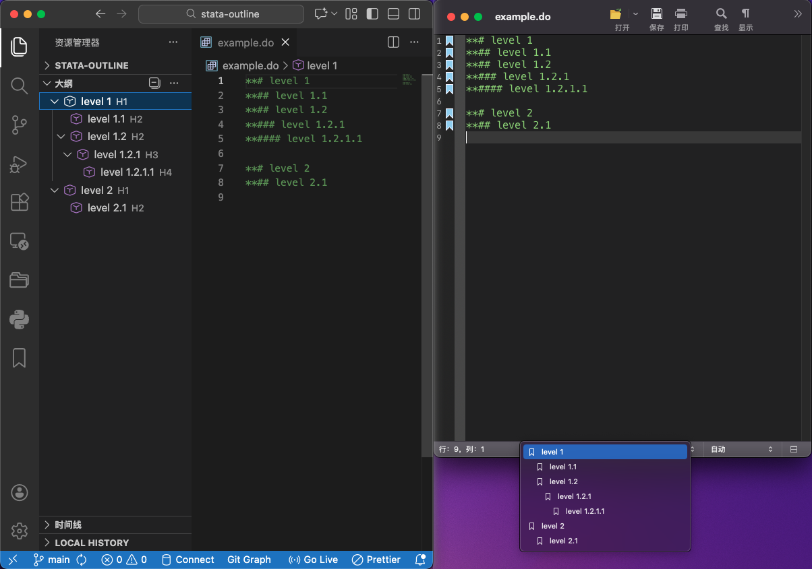

# Stata Outline / Stata 大纲

**Version / 版本:** 0.1.6

**Author / 作者:** Zihao Viston Wang / 王梓豪

## New Features / 新功能

- Add shortcut key function. 添加快捷键功能。
- Support for showing multi-level numbering in outline (e.g., 1.1, 1.2.1). Can be toggled in settings. 支持在大纲中显示多级序号（如 1.1, 1.2.1），可在设置中开关。
- Automatic file content update - Automatically adds/removes numbering in `.do` files when enabled. 自动文件内容更新 - 启用时自动在 `.do`文件中添加/删除序号。
- Run current section - Click the "Run" button in the editor or outline title bar to execute code from the current section. Requires [stataRun extension](https://marketplace.visualstudio.com/items?itemName=yeaoh.statarun). 运行当前 section - 点击编辑器或大纲标题栏中的“运行”按钮即可执行。需要安装 [stataRun 扩展](https://marketplace.visualstudio.com/items?itemName=yeaoh.statarun)。

---



> Example of Outline or Bookmark with hierarchical sections in a Stata `.do` file. (Left: VS Code, Right: Stata)
>
> Stata `.do` 文件中具有层次结构的大纲（书签）视图。（左侧：VS Code，右侧：Stata）

## Introduction / 介绍

- This VS Code extension adds **Outline support for Stata `.do` files**.
- It automatically recognizes comment lines with multiple `#` symbols as section headers, supporting hierarchical structure in the Outline view.

  - `**#` → Level 1
  - `**##` → Level 2
  - `**###` → Level 3
  - and so on…
- Supports shortcut keys:

  - `Ctrl+1/2/3/4/5/6` (Windows) or `Cmd+1/2/3/4/5/6` (Mac): Convert the current line to the corresponding level header.
  - `Ctrl+0` (Windows) or `Cmd+0` (Mac): Convert the current line to a normal line.

---

- 此VS Code扩展添加了**对Stata `.do`文件的大纲支持**。
- 它自动识别带有多个“#”符号的注释行作为节头，支持Outline视图中的层次结构。

  - `**#` → 一级标题
  - `**##` → 二级标题
  - `**###` → 三级标题
  - 依此类推…
- 支持快捷键：

  - `Ctrl+1/2/3/4/5/6` (Windows) 或 `Cmd+1/2/3/4/5/6` (Mac)： 将当前行转换为对应级别标题。
  - `Ctrl+0` (Windows) 或 `Cmd+0` (Mac)： 将当前行转换为普通行。

## Features / 特点

- Display hierarchical sections in Outline view based on comment markers.
- Supports unlimited levels by adding more `#`.
- Easy to navigate large `.do` files.

---

- 在大纲视图中根据注释标记显示层次结构部分。
- 通过添加更多的“#”支持无限级别。
- 便于浏览大型 `.do` 文件。

## Installation / 安装

### Extension Market Installation / 拓展市场安装

1. Search for "Stata Outline" in the VS Code extensions and install it.
2. Open any `.do` file and open the Outline panel (Explorer → Outline) to see the hierarchical sections.

---

1. 在VS Code扩展中搜索“Stata Outline”并安装。
2. 打开任何 `.do` 文件并打开大纲面板（资源管理器 → 大纲）以查看层次结构部分。

### Manual Installation / 手动安装

1. Download the `stata-outline-x.x.x.vsix` file from this [releases page](https://github.com/ZihaoVistonWang/stata-outline/releases).
2. Open VS Code → Extensions panel → Click `...` → `Install from VSIX...`
3. Select the downloaded `stata-outline-x.x.x.vsix` file.
4. Open any `.do` file and open the Outline panel (Explorer → Outline) to see the hierarchical sections.

---

1. 从此[发布页面](https://github.com/ZihaoVistonWang/stata-outline/releases)下载 `stata-outline-x.x.x.vsix` 文件。
2. 打开 VS Code → 扩展面板 → 点击 `...` → `从 VSIX 安装...`
3. 选择下载的 `stata-outline-x.x.x.vsix` 文件。
4. 打开任何 `.do` 文件并打开大纲面板（资源管理器 → 大纲）以查看层次结构部分。

## Configuration / 配置

### Settings / 设置

You can configure the numbering display in VS Code settings:

1. Open Settings (Ctrl+, or Cmd+,)
2. Search for "Stata Outline"
3. Configure the following options:

**Options:**

1. **"Display multi-level title numbers in the outline view"** (stata-outline.showNumbering)

   - `true`: Show numbered headings like "1.1", "1.2.1" in outline
   - `false` (default): Show original headings without numbers in outline
2. **"Automatically update section titles in .do files to include numbering"** (stata-outline.updateFileContent)

   - `true`: Automatically update .do file content to add/remove numbering to section titles
   - `false` (default): Only show numbering in outline, don't modify file content
3. **"Show the run button in the editor title bar"** (stata-outline.showRunButton)

   - `true` (default): Show the play button in editor title bar to run current section
   - `false`: Hide the run button

**Important Note:** The second option only works when the first option is enabled. When enabled:

- If `showNumbering` is `true`: Automatically adds numbering to section titles
- If `showNumbering` is `false`: Automatically removes numbering from section titles

**Note:**

- **After changing the above settings, you need to reopen the `.do` file for the changes to take effect.**
- When `updateFileContent` is disabled, any existing numbering in the .do files will be automatically removed.

---

可以在 VS Code 设置中配置序号显示：

1. 打开设置 (Ctrl+, 或 Cmd+,)
2. 搜索 "Stata Outline"
3. 配置以下选项：

**选项：**

1. **"在大纲视图中显示多级标题序号"** (stata-outline.showNumbering)

   - `true`: 在大纲中显示带序号的标题，如 "1.1", "1.2.1"
   - `false`(默认): 在大纲中显示原始标题，不带序号
2. **"自动更新.do文件中的section标题以包含序号"** (stata-outline.updateFileContent)

   - `true`: 自动更新.do文件内容，添加/删除标题中的序号
   - `false` (默认): 只在大纲中显示序号，不修改文件内容
3. **"在编辑器标题栏显示运行按钮"** (stata-outline.showRunButton)

   - `true` (默认): 在编辑器标题栏显示播放按钮，用于运行当前 section
   - `false`: 隐藏运行按钮

**重要提示：** 第二个选项只有在第一个选项启用时才有效。启用时：

- 如果 `showNumbering` 为 `true`: 自动向section标题添加序号
- 如果 `showNumbering` 为 `false`: 自动从section标题删除序号

**注意：**

- **上述设置调整后，需要重新打开 `.do` 文件以应用更改。**
- 当 `updateFileContent` 被禁用时，文件中现有的序号会被自动删除。

## Usage Example / 使用案例

```stata
**# Data Processing
**## Cleaning
**### Remove duplicates
**# Model Estimation
***## Regression Analysis
...
```

**With numbering enabled (showNumbering: true):**

- Outline shows: "1. Data Processing", "1.1 Cleaning", "1.1.1 Remove duplicates", "2. Model Estimation", "2.1 Regression Analysis"

**With numbering disabled (showNumbering: false):**

- Outline shows: "Data Processing", "Cleaning", "Remove duplicates", "Model Estimation", "Regression Analysis"

---

```stata
**# Data Processing
**## Cleaning
**### Remove duplicates
**# Model Estimation
***## Regression Analysis
...
```

**启用序号显示 (showNumbering: true):**

- 大纲显示: "1. Data Processing", "1.1 Cleaning", "1.1.1 Remove duplicates", "2. Model Estimation", "2.1 Regression Analysis"

**禁用序号显示 (showNumbering: false):**

- 大纲显示: "Data Processing", "Cleaning", "Remove duplicates", "Model Estimation", "Regression Analysis"

## 版本记录

| Version<br />版本 | Note<br />内容                                                                                                                                                                                                                                                                                                                                                                                | Date<br />发布时间 |
| :---------------- | :-------------------------------------------------------------------------------------------------------------------------------------------------------------------------------------------------------------------------------------------------------------------------------------------------------------------------------------------------------------------------------------------- | :----------------- |
| 0.1.5 - 0.1.6     | Run current section - Click the "Run" button in the editor or outline title bar to execute code from the current section. Requires[stataRun extension](https://marketplace.visualstudio.com/items?itemName=yeaoh.statarun). <br />运行当前 section - 点击编辑器或大纲标题栏中的“运行”按钮即可执行。需要安装 [stataRun 扩展](https://marketplace.visualstudio.com/items?itemName=yeaoh.statarun)。 | 2026-01-12         |
| 0.1.4             | Added multi-level numbering display in outline and automatic file content update feature. Can toggle numbering display and auto-update .do files.<br />添加大纲多级序号显示和自动文件内容更新功能，可切换序号显示和自动更新.do文件。                                                                                                                                                          | 2026-01-12         |
| 0.1.3             | Fixed the problem that `**#`,`**##`(that is, there is no space between `**` and `#`) are not displayed in the outline<br />修复 `**#`、`**##`（即 `**`与 `#`之间没空格）                                                                                                                                                                                                      | 2025-12-30         |
| 0.1.2             | Add shortcut key function.<br />添加快捷键功能。                                                                                                                                                                                                                                                                                                                                              | 2025-12-26         |
| 0.1.0 - 0.1.1     | Matches Stata's bookmark style, with comment lines starting with `**#`, etc. as section titles.<br />匹配Stata的书签风格，以 `**#`等开头的注释行作为节标题。                                                                                                                                                                                                                              | 2025-12-25         |
